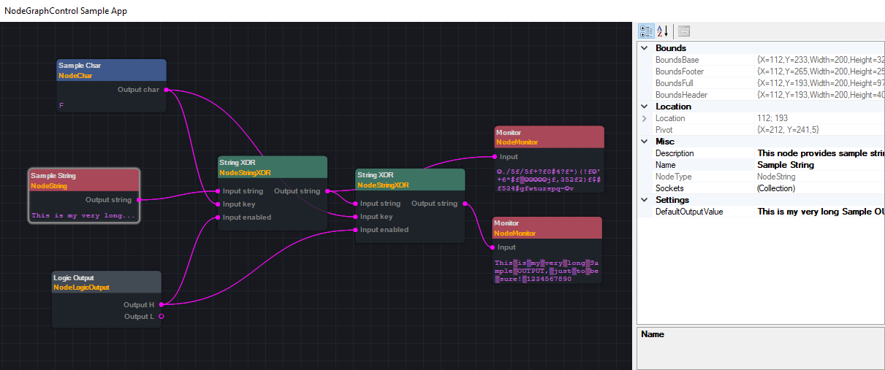
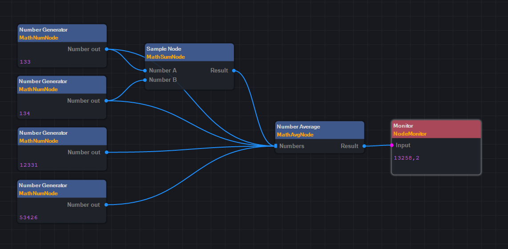

# NodeGraphControl

NodeGraphControl is .NET library that provides a component for node-based user interface. Custom nodes can be created easily by extending AbstractNode class and adding to context of the component.



## Long story short

Devices I use are synchronized with clouds and at the end of the day everything is on my hard drive. So first I wanted to create a node-based file manager that would collect files from multiple paths, look for duplicates, filter by preferences, and finally perform some operation, e.g. move, delete, copy with original file attributes, etc. Then I realised that my desired UI is quite complex so why not to have a versatile component for that.

## Version 0.1

Initial version.

## Version 0.2

### Goals

1. ~~Improve graphic performance~~ (resolved 21.2.21)
2. ~~Fix zoom - it should be transforming towards center of the screen~~ (resolved 21.2.21 - wow, such a productive Sunday)
3. ~~Make wires selectable~~ (resolved 24.2.21)
4. ~~Create new element 'SocketHub' - basically an input socket capable to be connected by multiple wires (requires point 3. to be completed)~~ (resolved 27.2.21)
5. ~~Code refactoring, spaghetti resolving~~ (partially resolved)

### Improvements

* (21.2.21) Graphic quality now depends on zoom value (the GDI+ had lower frame rate due to transparency while zoomed in)
* (21.2.21) Zoom is now operating towards the center of the screen
* (21.2.21) 'F' key focuses view to selection
* (21.2.21) Space key now resets view position
* (22.2.21) Added feature to optionally pair types with colors in which wires and sockets will be drown
* (22.2.21) Added experimental wire style appearance properties
* (24.2.21) Wires can be handled directly by dragging
* (27.2.21) Socket logic was reworked
* (27.2.21) SocketIn is now capable to take multiple connections



## Version 0.3-SNAPSHOT

### Goals
1. Currently the NodeGraph is 'always running'. Run strategy needs to be implemented. In AbstractNode there should be methods like Stop() and Reset() in addition to Execute()
2. AbstractNode should have context menu with options like delete, run, reset, etc
3. Selection should have context menu with options like delete-selection, copy, paste
4. Implement copy, paste
5. ~~Implement undo, redo~~ TODO in another version
6. Graphic performance was significantly improved in version 0.2, however, repaint strategy should be reconsidered again
7. Code refactoring

## UI controls

**Left mouse button** - select, marque select, move, wiring

**Middle mouse button** - pan, zoom

**Right mouse button** - context menu

**Ctrl + A** - sellect all

**Ctrl + Shift + A** - desellect all

**Shift** - select multiple

**Del** - delete selection

**X** - show bounds

**Alt** - switch name/type

**Space** - transform to center

**Esc** - back to edit mode

## Usage (sample)
```cs
public class SampleNode : AbstractNode {
        
        // input sockets
        private readonly AbstractSocket _numberA;
        private readonly AbstractSocket _numberB;
        
        // output socket
        private readonly AbstractSocket _resultOut;
        
        // empty constructor (optional)
        public SampleNode() : this(new Point(0, 0)) {
        }

        // main constructor
        public SampleNode(Point location) {
            Location = location;

            _numberA = new SocketIn(typeof(int), "Input number A", this);
            _numberB = new SocketIn(typeof(int), "Input number B", this);
            _resultOut = new SocketOut(typeof(int), "Result Output", this);

            Name = "Sample Node";
            NodeType = GetType().ToString().Split('.').Last();
            Description = "This node encodes string on input with XOR function.";
            BaseColor = Color.FromArgb(CommonStates.NodeColorAlpha, 31, 36, 42);
            HeaderColor = Color.FromArgb(62, 88, 140);

            _resultOut.UpdateValue(0);

            Sockets.Add(_numberA);
            Sockets.Add(_numberB);
            Sockets.Add(_resultOut);
        }
        
        // without use right now
        public override bool IsReady() {
            return true;
        }

        // Execute method
        public override void Execute() {
            int valueA = _numberA.GetValue() is int ? (int) _numberA.GetValue() : 0;
            int valueB = _numberB.GetValue() is int ? (int) _numberB.GetValue() : 0;
            _resultOut.UpdateValue(valueA + valueB);
        }
    }
```

### Created by
[amaurote](https://www.linkedin.com/in/tomas-borik-83032587/)

### License

This piece of software is licensed under [MIT License](../master/LICENSE)
