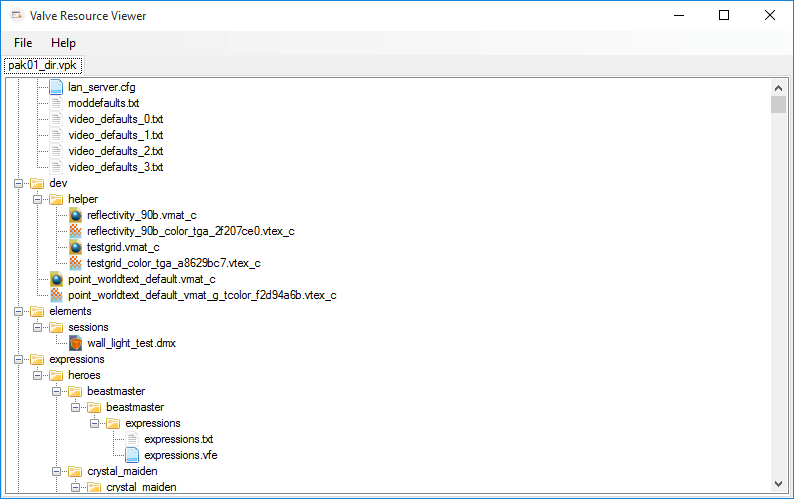
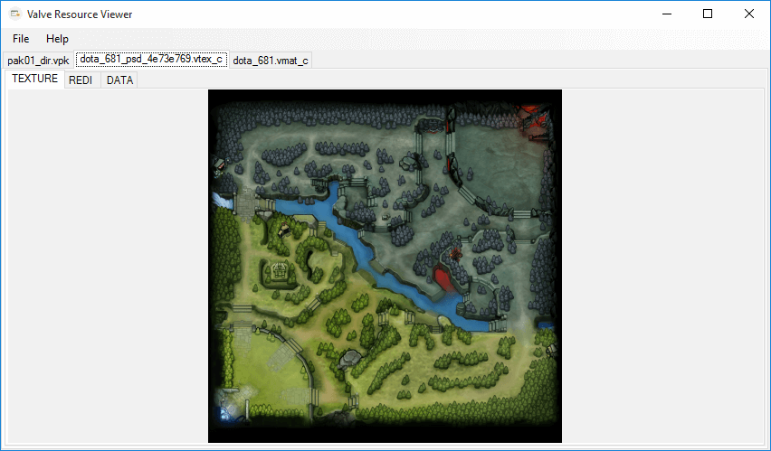

# Valve Resource Format

Valve's Source 2 resource file format *(also known as Stupid Valve Format)* parser and decompiler.

You can download latest builds from [AppVeyor here](https://ci.appveyor.com/project/xPaw/valveresourceformat/build/artifacts).

## GUI

This program allows opening all resource and package (VPKs) files for viewing and extracting.

