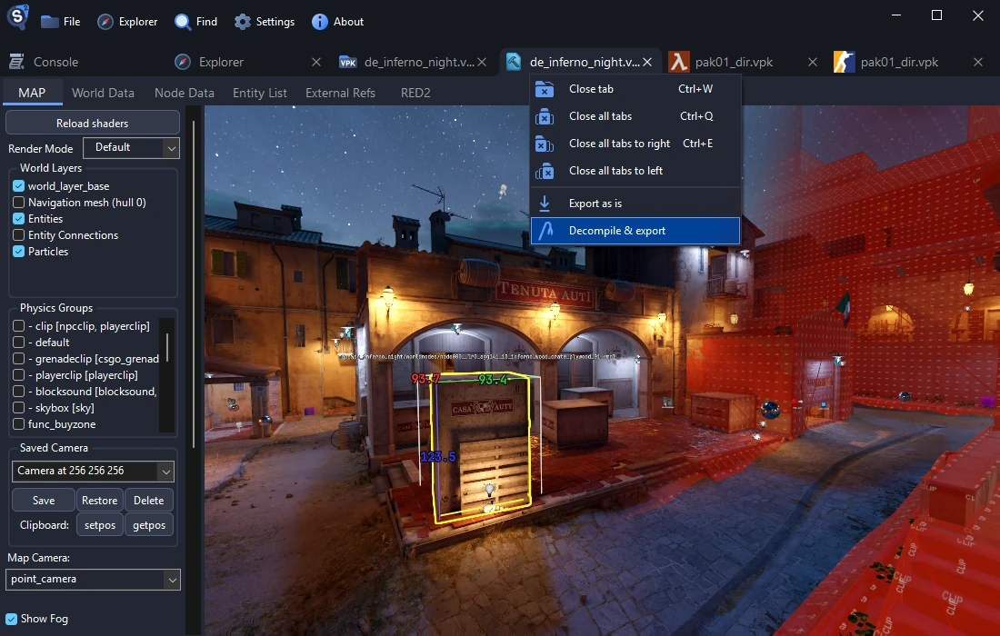

<h1 align="center"> Source 2 Viewer</h1>

    
    
    
    
    

Valve's Source 2 resource file format parser, renderer, decompiler, and exporter.
The library component is called **ValveResourceFormat (VRF)**.

> [!IMPORTANT]
> [**For more information and downloads of *Source 2 Viewer*, visit the website.**](https://s2v.app/)
>
> [View Library API documentation here.](https://s2v.app/ValveResourceFormat/api/ValveResourceFormat.html) [View guide on getting started with parsing resources.](https://s2v.app/ValveResourceFormat/guides/read-resource.html)

## Contributing

This tool is based entirely on reverse engineering
as Valve does not provide Source 2 documentation or code.
Not all formats are fully supported.
If you are interested in helping, take a look at the
[open issues](https://github.com/ValveResourceFormat/ValveResourceFormat/issues)
and join our Discord. See [CONTRIBUTING.md](CONTRIBUTING.md)
and [AGENTS.md](AGENTS.md) for more information.

Supported resource types

Ext           | Name                              | Support
------------- | --------------------------------- | -------
vagrp         | Animation Group                   | 👍
valst         | Action List                       | 👍
vanim         | Animation                         | 👍
vanmgrph      | Animation Graph                   | 👍
vcd           | Choreo                            | 👍
vcdlist       | Choreo Scene File Data            | 👍
vcompmat      | Composite Material                | 👍
vcss          | Panorama Style                    | 👍
vdata         | Data                              | 👍
vents         | EntityLump                        | 👍
vjs           | Panorama Script                   | 👍
vmap          | Map                               | 👍
vmat          | Material                          | 👍
vmdl          | Model                             | 👍
vmesh         | Mesh                              | 👍
vmix          | VMix                              | 👍
vmks          | Sheet                             | 👍
vmorf         | MorphSet                          | 👍
vnmclip       | NmClip                            | 👍
vnmgrph       | NmGraph                           | 👍
vnmikrig      | NmIKRig                           | 👍
vnmskel       | NmSkeleton                        | 👍
vnmvar        | NmGraph Variation                 | 👍
vpcf          | Particle System                   | 👍
vpdi          | Panorama Dynamic Images           | 👍
vphys         | Physics Collision Mesh            | 👍
vpost         | Postprocessing Settings           | 👍
vpram         | Processing Graph Instance         | 👍
vpsf          | Particle Snapshot                 | 👍
vpulse        | Pulse Graph Definition            | 👍
vrman         | ResourceManifest                  | 👍
vrmap         | Resource Remap Table              | No
vrr           | Response Rules                    | 👍
vseq          | Sequence Group                    | No
vsmart        | Smart Prop                        | 👍
vsnap         | Particle Snapshot                 | 👍
vsnd          | Sound                             | 👍
vsndevts      | Sound Event Script                | 👍
vsndstck      | Sound Stack Script                | 👍
vsurf         | Surface Properties                | No
vsvg          | Panorama Vector Graphic           | 👍
vtex          | Compiled Texture                  | 👍
vts           | Panorama TypeScript               | 👍
vvis          | World Visibility                  | No
vwnod         | World Node                        | 👍
vwrld         | World                             | 👍
vxml          | Panorama Layout                   | 👍
&nbsp;        | &nbsp;                            | &nbsp;
econitem      | Economy Item                      | 👍
herolist      | Dota Hero List                    | 👍
item          | Artifact Item                     | 👍
vdpn          | Dota Patch Notes                  | 👍
vdvn          | Dota Visual Novels                | 👍
&nbsp;        | &nbsp;                            | &nbsp;
bin           | Tools Asset Info                  | 👍 Handled by `ToolsAssetInfo`
dat           | Closed Captions                   | 👍 Handled by `ClosedCaptions`
vcs           | Compiled Shader                   | 👍 Handled by `CompiledShader`
vdacdefs      | DAC Game Defs Data                | No
vfe           | Flex Scene File                   | 👍 Handled by `FlexSceneFile`
vfont         | Bitmap Font                       | 👍 Decrypts `VFONT1`, supported in Source 1 and Source 2.
vpk           | Pak (package)                     | 👍 Handled by [ValvePak](https://github.com/ValveResourceFormat/ValvePak)

List of supported magics

Magic        | Description
------------ | ------------
`0x03564B56` | VKV\x03 - First binary keyvalues 3 encoding with custom block compression
`0x4B563301` | KV3\x01 - Binary keyvalues 3 (version 1)
`0x4B563302` | KV3\x02 - Binary keyvalues 3 (version 2)
`0x4B563303` | KV3\x03 - Binary keyvalues 3 (version 3)
`0x4B563304` | KV3\x04 - Binary keyvalues 3 (version 4)
`0x4B563305` | KV3\x05 - Binary keyvalues 3 (version 5)
`0x564B4256` | VBKV - binary keyvalues 1 (handled by ValveKeyvalue)
`0x55AA1234` | VPK - valve package (handled by ValvePak)
`0x44434356` | VCCD - closed captions
`0xC4CCACE8` | tools asset info
`0xC4CCACE9` | tools asset info (newer version)
`0x32736376` | vcs2 - compiled shader
`0x414D5A4C` | LZMA compression marker
`0x64637662` | bvcd - binary choreo scene
`0xFEEDFACE` | navigation mesh
`0xFADEBEAD` | grid navigation
`0x31415926` | murmurhash2 seed used by StringToken
`0xEDABCDEF` | murmurhash64 seed used to encode resource IDs
`VFONT1`     | "encrypted" font file
`0x00564645` | VFE - flex scene file

## GUI

Source 2 Viewer keeps its settings in `%LocalAppData%/Source2Viewer/settings.vdf`.

## License

Contents of this repository are available under [MIT license](LICENSE), except for `Tests/Files` folder which contains files that have likely come from Valve's games.

## Code signing policy

Free code signing provided by [SignPath.io](https://about.signpath.io), certificate by [SignPath Foundation](https://signpath.org).
