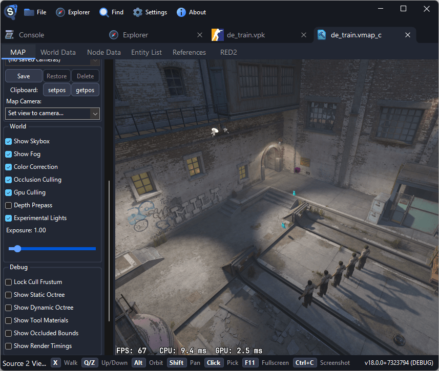

# Exporting Maps

Source 2 Viewer can export maps in two ways: as glTF for use in 3D software like Blender, or decompiled to `.vmap` for editing in Hammer Editor.

## Finding Maps

Maps are stored as `.vmap_c` files inside VPK archives or as standalone VPK files.

- **Official maps**: Each map is stored as its own VPK file (e.g., `de_dust2.vpk`) in the game's `maps/` directory. Inside the VPK, the map data is at `maps/<mapname>.vmap_c` alongside a `maps/<mapname>/` folder containing world nodes, entities, cubemaps, and other dependencies.
- **Workshop maps**: Stored as individual VPK files in Steam's workshop directory, which can be opened directly with Source 2 Viewer

::: warning
Some games include map files with a `_vanity` suffix (e.g., `de_dust2_vanity.vmap_c`). These are truncated versions used for main menu backgrounds. Use the version without the suffix instead.
:::

## Previewing Maps

Double-click a `.vmap_c` file to open the 3D map viewer. The viewer renders the full map with textures, props, and lighting.

The map viewer uses free-flight camera by default. Move the mouse to look around, and use <kbd>W</kbd><kbd>A</kbd><kbd>S</kbd><kbd>D</kbd> to move. Hold <kbd>Alt</kbd>+drag to orbit around a point, <kbd>Shift</kbd>+drag to pan, and scroll to adjust movement speed.

Press <kbd>X</kbd> to toggle walk mode, which enables FPS-style movement with collision and gravity. Click on objects in the scene to select and inspect their entity properties.



## Export to glTF

Use this workflow when you want to view or render the map in Blender or other 3D software.

1. Open the map's VPK file in Source 2 Viewer
2. Navigate to the `.vmap_c` file
3. Right-click and select **Decompile & Export**
4. Choose **glTF** as the format (GLB is also available but has a 2 GB size limit)
5. Select a save location and click Save

The export includes:

- Map geometry (brushes and meshes)
- Textures (exported as PNG files alongside the glTF)
- Props and models placed in the map
- Basic material information

::: tip
Map exports can be large. For a typical CS2 competitive map, expect the export to produce hundreds of texture files alongside the glTF.
:::

### Importing into Blender

1. Open Blender
2. Go to **File → Import → glTF 2.0 (.gltf/.glb)**
3. Select the exported map file
4. The map imports as a single scene with materials and textures applied

## Decompile to .vmap

Use this workflow when you want to open the map in Hammer Editor for editing or study.

1. Open the map file in Source 2 Viewer
2. Right-click the `.vmap_c` file and select **Decompile & Export**
3. Choose **vmap** as the file type
4. Save to your Workshop Tools addon content directory (see folder structure below)
5. Launch Hammer Editor through Workshop Tools and open the decompiled `.vmap`

### Folder Structure

The exported `.vmap` file and its dependency folder must be placed correctly inside your addon content directory. Your folder structure should look like this:

```
Counter-Strike Global Offensive/content/csgo_addons/your_addon/
└── maps/
    ├── cs_office.vmap
    └── cs_office/
        └── <map dependencies>
```

The `.vmap` file sits right next to its matching folder, both inside `maps/` in your addon content.

::: warning
If a `maps/` folder was exported alongside your `.vmap` file, you may need to move the `.vmap` file inside that `maps/` folder. Exporting outside addon content may not work as expected.
:::

::: danger
Do not use a decompiled map as your first mapping project if you are new to mapping! Decompiled output is messy and does not resemble how real `.vmap` files are made. Learn the basics of Hammer Editor first.
:::

::: warning
Map decompilation is not a perfect round-trip. The output will be imperfect:

- Models will be merged by material across the map
- Parts of the skybox mesh might be missing
- Collision will be merged into one mesh using special materials
- The map will lack lightmap resolution volumes
- Hammer meshes will be triangulated

The decompiled map is useful for learning and reference, but should not be expected to recompile identically.
:::

### Prerequisites for Hammer

To open decompiled maps in Hammer, you need the game's Workshop Tools installed:

1. In Steam, right-click the game → **Properties → DLC**
2. Enable and install the Workshop Tools DLC (available for CS2, Half-Life: Alyx, etc.)
3. Launch the Workshop Tools and create an addon if you haven't already
4. Save your decompiled `.vmap` into the addon's `maps/` folder

## Batch Map Export

For exporting multiple maps or automating the process, use the command-line utility:

```sh
Source2Viewer-CLI -i "maps/de_dust2.vpk" -o "exported/" -d
```

See the [command-line utility guide](./command-line.md) for more options.

## Limitations

- **glTF export** includes geometry, textures, and props but not lighting, game logic, or navigation meshes
- **vmap decompilation** may produce maps that don't compile perfectly due to data loss in the decompilation process
- Very large maps may take significant time and memory to export
