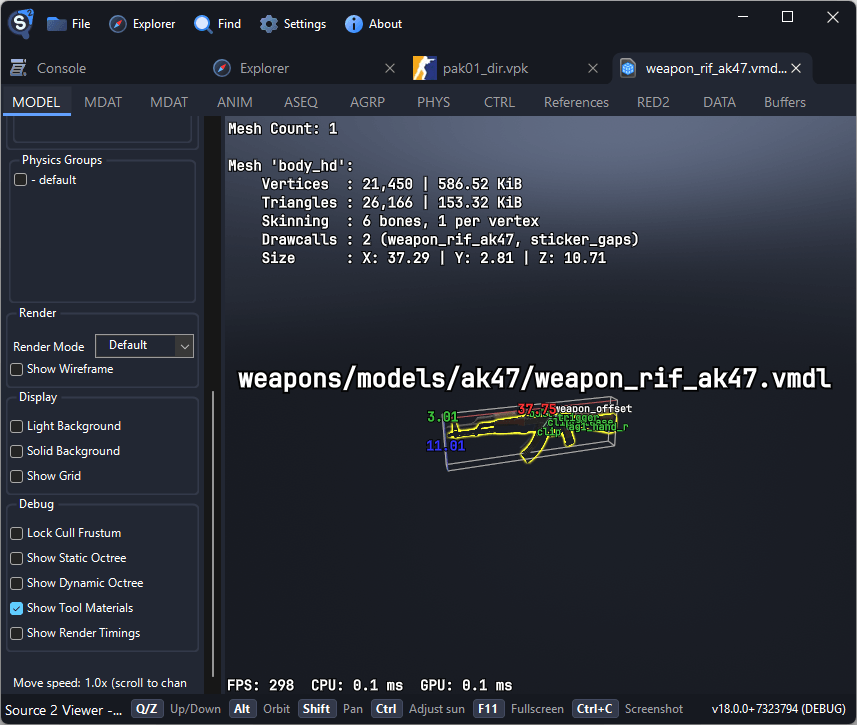

# Exporting Models

Source 2 Viewer can export 3D models from any Source 2 game to the standard glTF 2.0 format, which can be imported into Blender, Maya, 3ds Max, and other 3D software.

## Finding Models

Models are stored as `.vmdl_c` files inside VPK archives. In CS2, most assets are inside `pak01_dir.vpk`. Common locations:

| Game             | Path                 | Examples                                         |
| ---------------- | -------------------- | ------------------------------------------------ |
| Counter-Strike 2 | `weapons/models/`    | Weapon viewmodels and worldmodels                |
| Counter-Strike 2 | `characters/models/` | Player and agent models                          |
| Counter-Strike 2 | `models/`            | Props, vehicles, foliage, and other world models |
| Dota 2           | `models/heroes/`     | Hero models with cosmetics                       |
| Deadlock         | `models/heroes/`     | Hero models                                      |
| Half-Life: Alyx  | `models/characters/` | Characters and NPCs                              |

Use <kbd>Ctrl</kbd>+<kbd>F</kbd> to search for files by name.

## Previewing Models

Double-click a `.vmdl_c` file to open the 3D model viewer.

Controls:

- <kbd>Alt</kbd> + mouse drag to orbit the camera around the model
- <kbd>Shift</kbd> + mouse drag to pan the camera
- Scroll wheel to zoom in/out
- <kbd>Ctrl</kbd> + mouse drag to adjust the sun direction

The viewer shows the model with materials and textures applied. Use the toolbar to toggle wireframe, bounding boxes, and other debug overlays.

If the model has animations, they appear in a dropdown in the toolbar. Select an animation to preview playback. Relevant keyboard shortcuts are shown at the bottom of the viewer.



## Exporting to glTF

1. Open a `.vmdl_c` file in the viewer (or locate it in the file tree)
2. Right-click the file (or its tab) and select **Decompile & Export**
3. Choose a save location and filename
4. Select the export format: **glTF** or **GLB**
5. Click Save

The output format can be chosen in the save dialog. For 3D use, choose glTF or GLB. You can also export to the decompiled `.vmdl` source format.

The glTF export includes geometry, materials, textures, and the skeleton (if present).

### glTF vs GLB

| Format | Description                                             | Best for                          |
| ------ | ------------------------------------------------------- | --------------------------------- |
| glTF   | Folder with separate `.gltf`, `.bin`, and texture files | Recommended for most use cases    |
| GLB    | Single binary file containing everything                | Has a 2 GB size limit in the spec |

::: warning
GLB files are limited to 2 GB by the glTF spec. Use **glTF** instead, especially for large models or map exports.
:::

## Importing into Blender

1. Open Blender
2. Go to **File → Import → glTF 2.0 (.gltf/.glb)**
3. Select the exported file
4. The model imports with materials and textures already applied

The imported model includes the full mesh, UV maps, material assignments, and textures. If the model has a skeleton, it's imported as an Armature.

## Exporting Animations

Models with animations export them automatically when using the GUI.

For batch animation export via the command line:

```sh
Source2Viewer-CLI -i "model.vmdl_c" -o "output.gltf" -d \
    --gltf_export_format gltf \
    --gltf_export_animations \
    --gltf_animation_list "idle,walk,run"
```

See the [command-line utility guide](./command-line.md) for more options.
