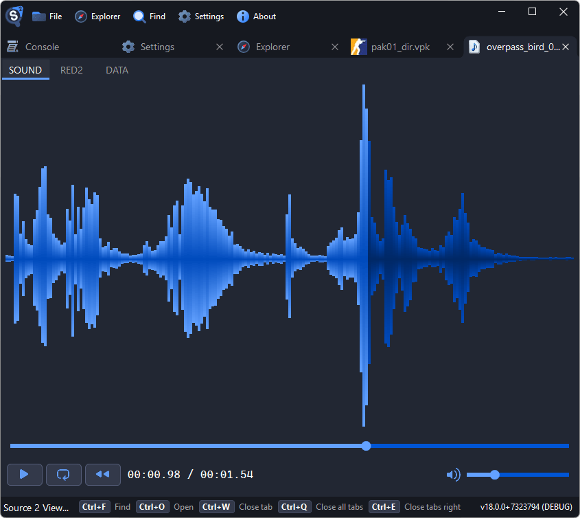

# Exporting Sounds

Source 2 Viewer can play and export audio files from Source 2 games. Sound files are decompiled back to WAV or MP3 format.

## Finding Sounds

- Sound files are `.vsnd_c` files, typically in `sounds/` or `sound/` folders
- Common subfolders:
    - `sounds/weapons/` for weapon firing, reload, and handling sounds
    - `sounds/vo/` or `sounds/voice/` for voice lines and dialogue
    - `sounds/music/` for music tracks and stingers
    - `sounds/ui/` for interface and menu sounds
    - `sounds/ambient/` for environmental and ambient sounds

## Audio Player

Double-click a `.vsnd_c` file to open the built-in audio player. It shows:

- A waveform visualization of the audio
- Play/pause, rewind, and loop controls
- Volume slider
- Duration and current position



## Exporting Sounds

1. Open a `.vsnd_c` file or locate it in the file tree
2. Right-click and select **Decompile & Export**
3. The file is saved as WAV or MP3

For batch export of an entire sound folder:

- Right-click the `sounds/` folder → **Decompile & Export**
- Or use the CLI:

```sh
Source2Viewer-CLI -i "pak01_dir.vpk" -o "exported/" -d \
    --vpk_extensions "vsnd_c" \
    --vpk_filepath "sounds/"
```

::: tip
Source 2 games store sounds in a compiled format internally. The decompiled output is standard WAV or MP3 depending on the original source format.
:::

## Sound Events

Source 2 uses sound event files (`.vsndevts_c`) to define how sounds are played in-game (volume, pitch, randomization, etc.). These can be viewed and decompiled as text files in Source 2 Viewer, which is useful for understanding how the game references its audio assets.
