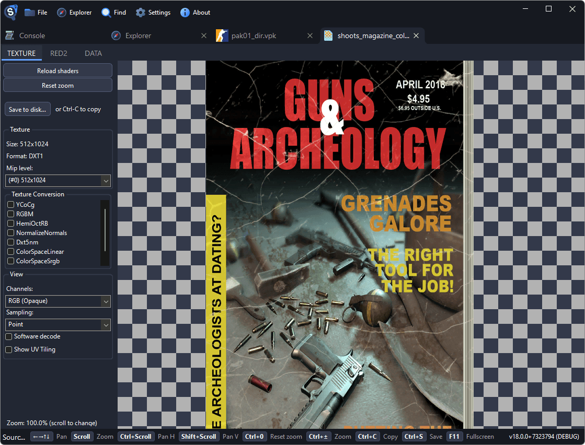

# Exporting Textures

Source 2 Viewer can preview and export textures from any Source 2 game to standard image formats.

## Finding Textures

- Textures are `.vtex_c` files, usually in `materials/` folders inside VPK archives
- Use <kbd>Ctrl</kbd>+<kbd>F</kbd> to search for textures by name
- Textures are also referenced by materials (`.vmat_c`). Opening a material shows which textures it uses

## Texture Viewer

Double-click a `.vtex_c` to open the texture viewer. Features:

- View individual channels: RGB, Red, Green, Blue, Alpha
- Toggle between mip levels to see different resolutions
- For cubemaps, view individual faces
- For texture arrays, browse individual slices
- HDR textures are tone-mapped for display



## Exporting

1. Open a `.vtex_c` file in the viewer
2. Right-click and select **Decompile & Export** (or use the save button in the viewer toolbar)
3. Choose the output format in the save dialog: **PNG**, **JPG**, or **EXR** (for HDR textures)

For batch export:

- Right-click a folder containing textures → **Decompile & Export** to export all textures at once
- Use the CLI for large-scale extraction:

```sh
Source2Viewer-CLI -i "pak01_dir.vpk" -o "exported/" -d \
    --vpk_extensions "vtex_c" \
    --vpk_filepath "materials/models/heroes/"
```

## Texture Types

Source 2 uses several texture types you'll encounter:

- **Color/Albedo** (`_color`): The base color/diffuse texture
- **Normal map** (`_normal`): Surface detail for lighting. These appear purple/blue in the viewer
- **Roughness/Metalness**: PBR material properties, often packed into channels of a single texture
- **Mask textures**: Various masks packed into RGBA channels (detail mask, self-illum, specular, etc.)
- **AO** (`_ao`): Ambient occlusion

::: tip
Normal maps and mask textures may look wrong if you view only the RGB channels. Switch to individual channel view to understand what data each channel contains.
:::

## HDR and Cubemap Textures

- HDR textures (used for skyboxes and environment probes) are stored in higher precision formats
- Cubemap textures have 6 faces. Use the face selector in the viewer to browse them
- HDR textures can be exported as EXR to preserve the full dynamic range, or as PNG/JPG (tone-mapped)
