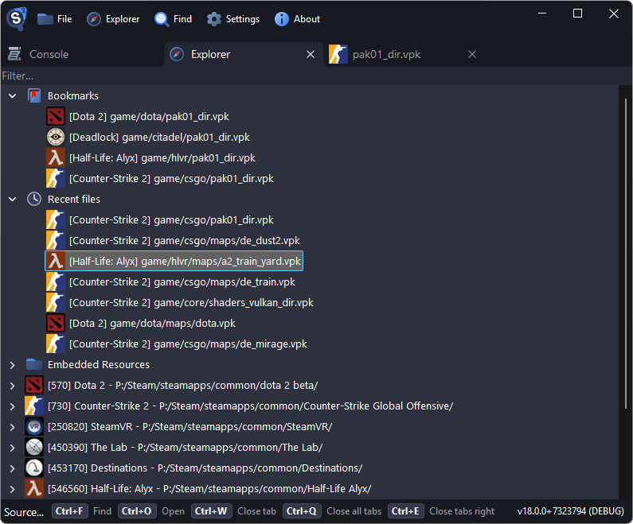

# Getting Started

This guide walks you through the basics of using Source 2 Viewer to browse, preview, and export Source 2 game assets.

## Downloading Source 2 Viewer

Download the latest release from [s2v.app](https://s2v.app).

Source 2 Viewer is portable and requires no installation. Just run the executable directly.

- **Source 2 Viewer** (GUI) is Windows-only. It can be run on Linux/macOS using Wine.
- **Source2Viewer-CLI** (command-line) is cross-platform. Download for your target platform is available in the changelog section.

## Using the Explorer

The **Explorer** tab is the main way to browse game files. It opens by default on launch (this can be disabled in settings) and is accessible from the top bar. It automatically discovers all installed Steam games and their VPK archives, including workshop content. Click a game to expand it and browse its files.

The Explorer also shows:

- **Recent files** at the top, so you can quickly reopen files you've worked with before
- **Bookmarks** for files you've saved for later. Right-click any file and select bookmark to add it

## Opening Files Manually

There are several ways to open files:

- Use **File → Open** (<kbd>Ctrl</kbd>+<kbd>O</kbd>) to browse for any `.vpk` file or individual Source 2 files (`.vmdl_c`, `.vtex_c`, etc.)
- Drag and drop files or folders directly onto the window

## Searching

Press <kbd>Ctrl</kbd>+<kbd>F</kbd> to open the search dialog. It supports several search modes:

- File Name (Partial Match)
- File Name (Exact Match)
- File Full Path
- Regex
- File Contents (Case Sensitive)
- File Contents Hex Bytes

Results are shown in a list with file name, size, and type columns.

## Previewing Assets

Double-click any file to open it in a new tab. Different file types get specialized viewers:

- **Models** (`.vmdl_c`) → 3D viewer with orbit, pan, zoom
- **Textures** (`.vtex_c`) → Image viewer with channel isolation (RGB, Alpha)
- **Sounds** (`.vsnd_c`) → Audio player with waveform
- **Maps** (`.vmap_c`) → 3D map viewer
- **Materials** (`.vmat_c`) → Material parameter viewer
- Other formats → Text/hex viewer

A preview mode can be enabled in settings. When active, selecting a file in the tree will automatically display it instead of showing the file list.

Relevant keyboard shortcuts are shown at the bottom of each viewer.

## Exporting Files

Right-click a file to access two export modes:

- **Export as is** saves the raw compiled file without any conversion. Use this when you need the original Source 2 format.
- **Decompile & export** converts files to standard editable formats. The output format can be chosen in the save dialog:
    - Models → glTF (.gltf/.glb) or decompiled .vmdl
    - Maps → glTF or decompiled .vmap (for Hammer Editor)
    - Textures → PNG, JPG, or EXR (for HDR textures)
    - Sounds → WAV or MP3
    - Materials → .vmat
    - Physics (`.vphys_c`) and navigation meshes (`.nav`) → glTF
    - Other resources → Their decompiled text format

::: tip
"Decompile & export" is what most people want. It produces files you can directly open in Blender, image editors, audio players, or Hammer Editor.
:::

## Batch Operations

- **Select multiple files:** Hold <kbd>Ctrl</kbd> and click to select individual files, or hold <kbd>Shift</kbd> to select a range
- **Export entire folders:** Right-click a folder and choose an export option to export everything inside it

::: tip
For large batch exports, consider using the [command-line utility](./command-line.md) which supports multi-threaded extraction.
:::

## Issues

If you have questions or want to chat, join the Discord server.

If you want to report a bug or request a feature, please test the [dev version](https://s2v.app/dev/) first as it may already be fixed. When filing an issue on GitHub, follow the issue template.

Source 2 Viewer keeps its settings in `%LocalAppData%/Source2Viewer/settings.vdf`.
